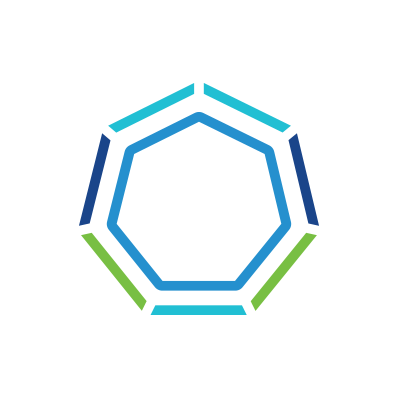

# VMware Tanzu Demo

Demo material for developers on [VMware Tanzu](https://tanzu.vmware.com/).

Consists of three [Spring Boot](https://spring.io) microservices, communicating over [RabbitMQ](), backed by a Redis key value store, all running on Kubernetes.
When source code changes, the applications are rebuilt using [Build Service](https://tanzu.vmware.com/build-service) and redeployed to [Enterprise PKS](https://cloud.vmware.com/vmware-enterprise-pks) using [Concourse](https://tanzu.vmware.com/concourse).

Both platform and applications are managed using [Mission Control](https://tanzu.vmware.com/mission-control) and monitored using [Observability by Wavefront](https://tanzu.vmware.com/observability).

## Use Case - Payment Application

## Installation

### Data Services

#### RabbitMQ

Make sure you are targeting the correct Kubernetes namespace:

```bash
kubens default
``` 
or whichever namespace you want to run your apps in.

Install the RabbitMQ cluster through the provided Helm chart. These can be found in [Bitnami's extensive catalog](https://github.com/bitnami/charts/tree/master/bitnami/rabbitmq).

```bash
helm repo add bitnami https://charts.bitnami.com/bitnami
helm install rabbitmq bitnami/rabbitmq --values kubernetes/services/rabbitmq-helm-values.yaml
``` 

#### Redis

Make sure you are targeting the correct Kubernetes namespace:

```bash
kubens default
``` 
or whichever namespace you want to run your apps in.

Install the Redis cluster through the provided Helm chart.
These can be found in [Bitnami's extensive catalog](https://github.com/bitnami/charts/tree/master/bitnami/redis).
Disable the Sentinel feature for now, since Spring Cloud Stream has had issues connecting to it.

```bash
helm repo add bitnami https://charts.bitnami.com/bitnami
helm install redis bitnami/redis --values kubernetes/services/redis-helm-values.yaml
```

### Tanzu Build Service (kpack)

Tanzu Build Service is a supported, Enterprise-ready version of `kpack` with added features like advanced authentication, management UI and more.
For demo purposes, we'll simply install the opensource version `kpack`.

Navigate to the `kubernetes/cicd/kpack` folder and execute the YAML files one by one:

```bash
kubectl apply -f 01-kpack-release-0.0.8.yaml 
kubectl apply -f 02-github-creds.yml
kubectl apply -f 03-dockerhub-creds.yml
kubectl apply -f 04-custom-java-builder.yml
```

### Wavefront

If we want to send metrics and tracing information to Wavefront, we need to setup a simple Wavefront proxy.
Navigate to the `kubernetes/metrics` and deploy the Wavefront token (containing the API key) and the Wavefront proxy itself.

```bash
kubectl apply -f wavefront-token.yaml
kubectl apply -f wavefront-proxy.yaml
```

This will run 1 replica of the proxy, so depending on the load you expect, you can simply increase the amount of replicas.

### Concourse

Installing Concourse is, just as the data services, done through a Helm chart.

```bash
helm repo add concourse https://concourse-charts.storage.googleapis.com
helm install concourse concourse/concourse -f concourse-helm-values.yaml
```

Once the pods and services are running, find the public LoadBalancer IP of the Concourse web app.
Configure your DNS by adding an `A Record` linking the Concourse FQDN to that IP.

Then try to login to Concourse through the Web UI or by using the `fly` CLI:

```bash
fly login -t concourse -c http://concourse.beijing.cf-app.com -k -u USERNAME -p PASSWORD
```

#### Setting up the pipelines

Once you have Concourse up and running, you can add the pipelines for each service:

```bash
fly -t concourse set-pipeline -p account-service -c pipeline.yml -l k8s.yaml -v kubernetes-deployment=account-service -v kubernetes-container=account-service -v container-image=dhubau/account-service
fly -t concourse set-pipeline -p confirmation-service -c pipeline.yml -l k8s.yaml -v kubernetes-deployment=confirmation-service -v kubernetes-container=confirmation-service -v container-image=dhubau/confirmation-service
fly -t concourse set-pipeline -p payment-service -c pipeline.yml -l k8s.yaml -v kubernetes-deployment=payment-service -v kubernetes-container=payment-service -v container-image=dhubau/payment-service
```

These pipelines will watch the Docker registry for changes in container images.
When a new container image is found, it will trigger a redeployment of the container under the existing deployment.

Dont' forget to unpause the pipelines, or nothing will happen.